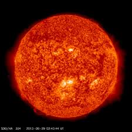
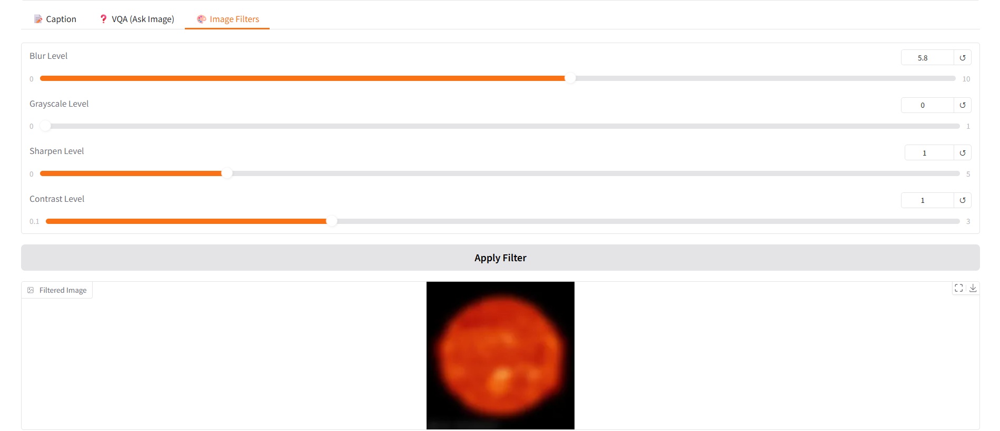
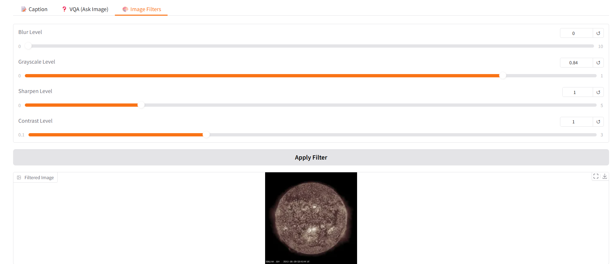
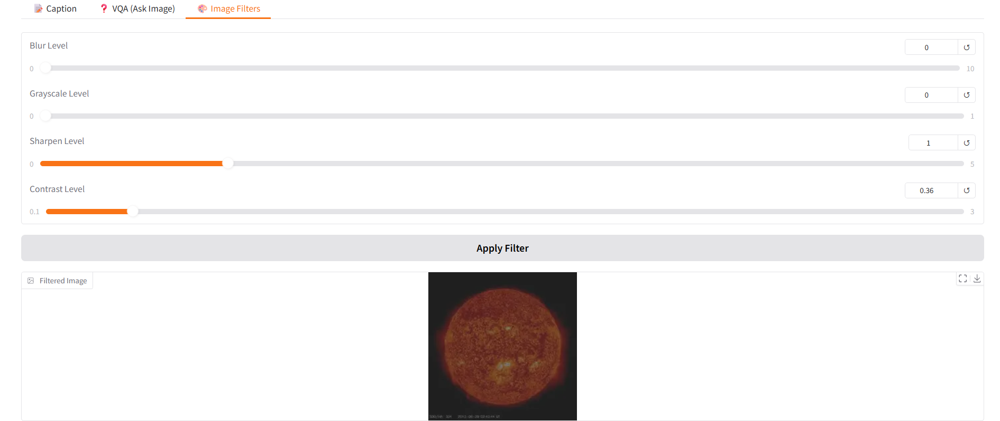

本次作業使用 Gradio 建立，使用只要上傳圖片便可使用三項主要功能：

(1) 圖片描述 (Image Captioning)

使用Hugging Face提供的BLIP image captioning model，先透過 Vision Transformer (ViT) 萃取圖片特徵，再由語言模型生成自然語言描述，程式中透過 BlipProcessor 負責前處理與 Tokenize，BlipForConditionalGeneration 負責 caption sentence 生成，並使用 .generate()方法產生敘述文字。

(2) 圖像問答 (Visual Question Answering, VQA)

採用 BLIP-VQA 模型，讓使用者輸入問題並針對圖片內容作答。，將圖片與文字問題 encode 後送入 BlipForQuestionAnswering，透過 cross-modal attention 結合視覺與語言特徵，最後模型生成答案。

(3) 圖片濾鏡與亮度/銳化/對比度調整等影像增強功能

使用 Python 的 PIL 套件 (ImageFilter、ImageOps、 ImageEnhance) 進行影像處理。模糊效果透過 GaussianBlur 設定 radius 實現，灰階效果以 Image.blend 混合原圖與灰階版達到可調強度，銳化與對比度則使用 ImageEnhance 調節系數來控制增強程度。這些效果以 Gradio slider控制，可以提供這些效果調整影響程度。

以下為app操作示範

上傳圖片即可開始操作

(1)圖片描述，按下"Generate Caption"按鈕，便可以生成一段對圖片的敘述

(2)圖像問答，輸入問題按下按鈕，即可得到回覆

(3)圖片濾鏡，上傳圖片後，可以選擇各種效果程度，並按下"Apply Filter"

原本圖片:

模糊效果:

灰階:

銳化:

對比度(明暗度):

